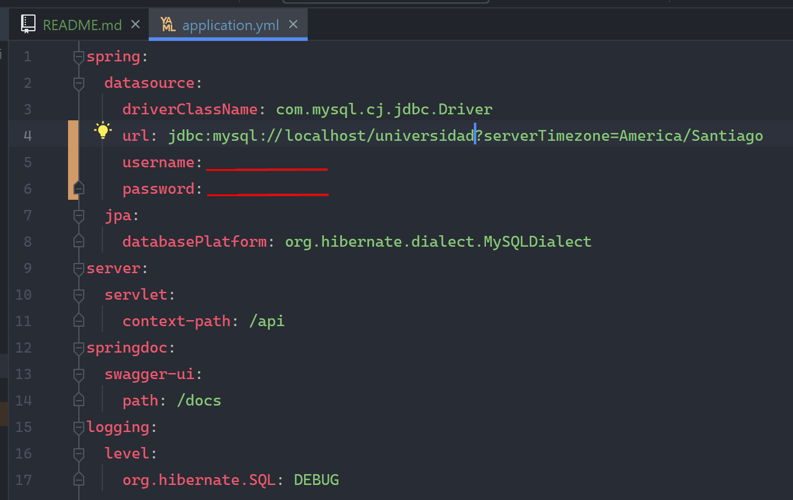

# pago-qr-api

### API de para el pago de QR

Está api esta hecha en con java y spring-boot

Requisitos de ejecución

- Tener instalado Intellij de jetbrains
- Configurar en `application.yml` username y password de MySQL
- Y ejecutar con el respectivo boton de 'play' en el IDE

