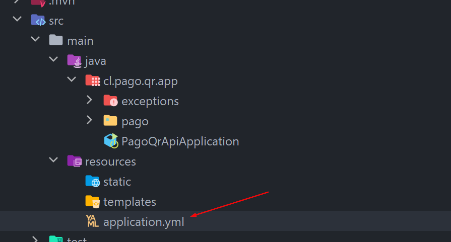

# API - Sistema de pagos con QR

API creada para manejar la gestión de pagos realizados a través de la [App Web](https://github.com/Moanbea3/QR.git "App Web") y móvil.

---

## Requisitos

- Tener instalado motor de BBDD MySQL
- Tener instalado IntelliJ de jetbrains
- Actualizar en `application.yml` **username** y **password** con las credenciales que empleas para establecer la conexión con MySQL

## Ejecución 

Una vez abierto el proyecto en IntelliJ solo hacer clic en el boton como se muestra en la imagen

